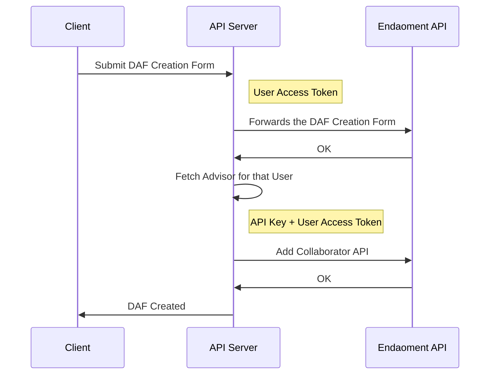

# Adding Collaborators to DAFs

Collaborators are additional users who can interact with your DAF in a limited capacity:

- Collaborators can recommend operations to be executed by the Fund Manager, such as:
  - Making contributions to the fund
  - Recommending grants to charitable organizations
  - Suggesting investment changes
- The Fund Manager maintains full control and can:
  - Approve or reject operations proposed by Collaborators
  - Remove Collaborators from the fund at any time
  - Manage Collaborator permissions
- Collaborators cannot:
  - Execute operations directly without Manager approval
  - Modify fund settings or structure
  - Add or remove other Collaborators

## Platform Requirements

To enable Collaborator Management on your platform, you must review and agree to Endaoment's Terms and Conditions for Collaborator Management and Pass our security and compliance review.

For assistance with enabling this feature or to request access, please contact our Platform Integration team at admin@endaoment.org.

We'll guide you through the necessary steps and documentation requirements. If approved, you will receive and API Key that will allow you to call the `Manage Collaborator` APIs.

## User Prerequisites

To add someone as a collaborator:

1. The user adding the collaborator must be authenticated via OAuth (see [Login User Documentation](../docs/login-user.md))
2. The person being added as a collaborator must also have an Endaoment account and be authenticated through your application
3. You'll need the Endaoment user ID of the person being added as a collaborator, which is obtained after they authenticate through your platform.

This ensures:

- Proper authentication of both parties
- Secure access control for the DAF
- Clear audit trail of who added whom as a collaborator
- The collaborator can access the DAF through your application with appropriate permissions

## Flow overview

- The [Add Collaborator API](https://api.dev.endaoment.org/oas#/Funds/FundsController_addFundCollaboratorTrust) allows your platform to add new collaborators to DAFs that belong to users connected to your application
- Due diligence on collaborators must be performed by the integrator platform, as per contractual agreements, before they can be added to DAFs
- The API will only allow collaborators to be added if:
  - The requesting user, identified by the Access Token, owns the DAF
  - The collaborator has an active Endaoment account
  - The platform is allowed to add collaborators to user's DAF's

There are several ways to implement collaborator management using our API:

1. **Pre-selection Model**

   - Your platform automatically assigns a trusted advisor (e.g., a Private Wealth Manager) as a collaborator when the DAF is created
   - This model works well for wealth management platforms where clients already have an established relationship with an advisor
   - See our [quickstart example](../quickstart/) for a reference implementation

2. **Trusted List Model**

   - Your platform maintains a vetted list of approved collaborators
   - Users can select collaborators only from this pre-approved list
   - This provides control while still giving users choice
   - Recommended for platforms that work with a network of verified professionals

3. **Review & Approval Model**
   - Users can request any collaborator
   - Your platform's back office reviews each request
   - Only approved collaborators are added via the Endaoment API
   - Best for platforms that need maximum flexibility but want oversight

Our quickstart code, as well as the example below, use the Pre-selection model due to it's simplicity and common use case.



## Step-by-step Instructions

### 1. Select and Validate the Collaborator

Before calling the Add Collaborator API, you'll need to implement the logic to select and validate potential collaborators. Here are the key considerations:

#### Selecting the Collaborator

- You must obtain the Endaoment User ID of the person you want to add as a collaborator
- This ID is obtained after the collaborator authenticates through your platform
- The selection process can be implemented in various ways:
  - User selection from a pre-approved list
  - Automatic assignment based on business rules
  - Manual input by the DAF owner

#### Example Implementation

In our quickstart example, we demonstrate a simple checkbox approach where users can opt to add their Platform-assigned Financial Advisor as a collaborator:

```html
<div>
  <label htmlFor="addMyAdvisorToDaf">
    <input type="checkbox" id="addMyAdvisorToDaf" name="addMyAdvisorToDaf" />
    Add my Financial Advisor to the DAF
  </label>
</div>
```

When the user selects this option, the system automatically adds their Financial Advisor during DAF creation. This logic is implemented in the [create-daf.ts file](../quickstart/backend/src/routes/create-daf.ts):

```typescript
// If the user wants to add their financial advisor to the DAF, we need to add them as a
// collaborator at Endaoment
if (addMyAdvisorToDaf) {
  console.log('Adding my advisor to the DAF');
  await addCollaboratorToFund(response.id, token);
}
```

### 2. Call the Add Collaborator API

Once you have selected and validated the collaborator, you can proceed with adding them to the DAF using the Add Collaborator API.

#### API Requirements

- The requesting user (identified by the Access Token) must be the owner of the DAF
- Your platform must have a valid API key with collaborator management permissions
- The collaborator must have an active Endaoment account
- The request must include:
  - The DAF ID (`fundId`)
  - The collaborator's Endaoment User ID (`userId`)
  - A company name for the collaborator (`companyName`)

#### Example Implementation

The following code snippet, taken from the [add-collaborator.ts file](../quickstart/backend/src/utils/add-collaborator.ts), demonstrates how to call the API:

```typescript
const body: CreateFundCollaboratorBody = {
  companyName: 'Endaoment Wealth',
  userId,
};

// To see the full API documentation and data contract, visit https://api.dev.endaoment.org/oas#/Funds/FundsController_addFundCollaboratorTrust
const addCollaboratorResponse = await fetch(
  `${getEndaomentUrls().api}/v1/funds/${fundId}/collaborators/trust`,
  {
    method: 'POST',
    headers: {
      'Content-Type': 'application/json',
      Authorization: `Bearer ${token}`,
      'x-api-key': apiKey,
    },
    body: JSON.stringify(body),
  },
);
```

#### Response Handling

- The API will return a success response if the collaborator is added successfully
- If there are any issues (e.g., invalid permissions, inactive account), the API will return an appropriate error response
- Your platform should handle both success and error cases appropriately
- Consider implementing retry logic for transient failures
- Log all API responses for audit purposes

For complete API documentation and data contract details, visit the [Add Collaborator API endpoint](https://api.dev.endaoment.org/oas#/Funds/FundsController_addFundCollaboratorTrust).

## Collaborator Actions

This part of the documentation is still under construction. Let us know if you have interest in this section before we build it out for you!
