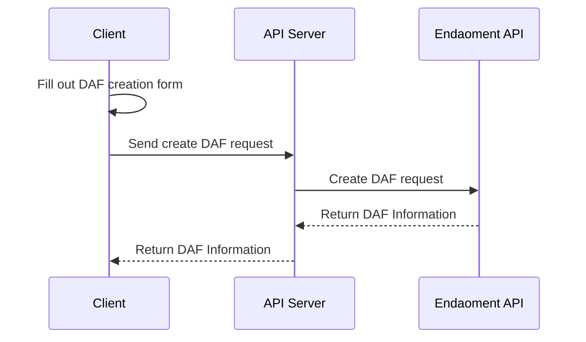

# Donor-Advised Fund (DAF) Creation

This guide will walk you through the process of creating a Donor Advised Fund (DAF) on the Endaoment platform while using your application as the intermediary.

Following this guide will result in the following:

- A UI that allows a user to enter in details for a new DAF and submit it to your backend
- A backend endpoint that will receive the DAF details and create a new DAF on the Endaoment platform
  - For the purposes of this guide it will be called `/create-daf`
- A UI that will allow a user to view the details of their newly created DAF

## What is a Donor-Advised Fund?

A Donor-Advised Fund (DAF) is a charitable giving vehicle that allows donors to make tax-deductible contributions to a dedicated fund they control. Think of it as a "Giving Account" that you can contribute to at any time and then use to support the causes you care about.

With a DAF:
- You make contributions to your fund when it's convenient for you
- Your contributions may be eligible for immediate tax benefits
- Your funds can be invested and potentially grow tax-free
- You can recommend grants to eligible nonprofit organizations whenever you're ready

DAFs simplify the giving process while providing flexibility in how and when you support charitable organizations.

### Who is the DAF Manager?

The DAF Manager is the technical entity that has programmatic capabilities to interact with fund and perform operations on it. The manager has a wallet address and can execute programmatic functionalities such as:
- Processing contributions
- Executing grants
- Managing fund operations

The manager can be the same person/entity as the advisor or act on behalf of the advisor.

### Who is the DAF Primary Advisor?

The DAF Primary Advisor is the real-world person or entity who serves as the public contact for the fund. Unlike the manager, the advisor doesn't have technical capabilities but rather represents the human or organizational side of the fund. The advisor:
- Is listed as the official contact for the fund
- May be contacted by organizations or other parties regarding the fund
- Can be the same person/entity as the manager or be represented by the manager

## Prerequisites

Before you begin, ensure you have completed the [User Login Guide](./login-user.md) as users must be authenticated to create a DAF.

## Flow Overview



## Step-by-Step Instructions

### 1. Prepare the DAF creation form

Once a user has logged in, they should gain the ability to create new DAFs for their account. In order to facilitate this, you will need to create a form that allows them to enter in the details of the new DAF. The example below is the simplest form that can be used to create a DAF but you should customize it to fit your application's needs.

Your UI should collect all required information for creating a DAF through the [Create a DAF API](https://api.dev.endaoment.org/oas#/Funds/FundsController_processFund)

```html
<form id="create-daf-form" action="[your-backend]/create-daf" method="POST">
  <label for="name">Name</label>
  <input type="text" id="name" name="name" required />

  <label for="description">Description</label>
  <textarea id="description" name="description" required></textarea>

  <label for="fundAdvisor.firstName">Advisor First Name</label>
  <input
    type="text"
    id="fundAdvisor.firstName"
    name="fundAdvisor.firstName"
    required />

  <label for="fundAdvisor.lastName">Advisor Last Name</label>
  <input
    type="text"
    id="fundAdvisor.lastName"
    name="fundAdvisor.lastName"
    required />

  <label for="fundAdvisor.email">Advisor Email</label>
  <input
    type="email"
    id="fundAdvisor.email"
    name="fundAdvisor.email"
    required />

  <label for="fundAdvisor.address.line1">Advisor Address Line 1</label>
  <input
    type="text"
    id="fundAdvisor.address.line1"
    name="fundAdvisor.address.line1"
    required />

  <label for="fundAdvisor.address.line2">Advisor Address Line 2</label>
  <input
    type="text"
    id="fundAdvisor.address.line2"
    name="fundAdvisor.address.line2" />

  <label for="fundAdvisor.address.city">Advisor City</label>
  <input
    type="text"
    id="fundAdvisor.address.city"
    name="fundAdvisor.address.city"
    required />

  <label for="fundAdvisor.address.state">Advisor State</label>
  <input
    type="text"
    id="fundAdvisor.address.state"
    name="fundAdvisor.address.state"
    required />

  <label for="fundAdvisor.address.zip">Advisor Zip</label>
  <input
    type="text"
    id="fundAdvisor.address.zip"
    name="fundAdvisor.address.zip"
    required />

    <label for="fundAdvisor.address.country">Advisor Country (Must be an ISO 3166-1 alpha-3 Country Code)</label>
    <input
            type="text"
            id="fundAdvisor.address.country"
            name="fundAdvisor.address.country"
            placeholder="USA"
            required
    />

  <button type="submit">Create DAF</button>
</form>
```

Note how the form is set up to send a POST request to your backend service at `/create-daf`. This is where the DAF details will be sent to be verified and then sent to the Endaoment API.

When submitting this form, the logged-in user **will be assigned as the Manager of the fund.**

### 2. Orchestrate the DAF creation request

When the user submits the form, the details will be sent to your backend service. We will of course need to create an endpoint that can receive this information and then send it to the Endaoment API to create the DAF. For the purposes of this guide, we will assume that the endpoint is `/create-daf`.

While an extremely minimal approach could simply proxy the request to the Endaoment API while adding the user's access token, it is recommended to verify the details of the DAF before sending the request to the Endaoment API.

```js
// This is the part that should be called by your `create-daf` route handler
async function createDaf(req, res) {
  const newFundName = req.body['name'];
  const newFundDescription = req.body['description'];
  const newFundAdvisor = req.body['fundAdvisor'];

  if(!newFundName || !newFundDescription || !newFundAdvisor) {
    // Return an error response if any of the required fields are missing
    res.status(400);
    res.end();
    return;
  }

  // Continue to send the new DAF details to the Endaoment API, read on to see what goes here
  ...
}
```

Once the details sent to your backend service have been verified, we will send a request containing that information over to the Endaoment API to create the DAF.

```js
// This is the part that should be called by your `create-daf` route handler
async function createDaf(req) {
  // Input verification would go here
  ...

  // Pull the user's token from the request
  // This is entirely dependent on your application's setup and the manner in which you store tokens
  const token = req.cookies['ndao_token'];

 // For more details about the data contract of the API, see the API reference:
  // https://api.dev.endaoment.org/oas#/Funds/FundsController_processFund
  const fundCreationResponse = await fetch('https://api.dev.endaoment.org/v1/funds', {
    method: 'POST',
    headers: {
      'Content-Type': 'application/json',
      // Pass the user's token in the Authorization header
      'Authorization': `Bearer ${token}`,
    },
    body: JSON.stringify({
      fundInput: {
        // The details of the new DAF will be sent here
        // Make sure to replace this with the actual details from the request
        name: newFundName,
        description: newFundDescription,
        advisor: newFundAdvisor,

        // The full list of fields can be found in the API Reference
        // ...
      }
    }),
  });

  // We can now return the response to the frontend, it contains the full details of the new DAF
  res.status(200);
  res.json(await fundCreationResponse.json());
  res.end();
}
```

The endaoment API will return the full details of the newly created DAF, at this point the user has successfully created a DAF on the Endaoment platform and can begin contributing to it. Any further actions are at the discretion of your application.

### 3. (Optional) Display the new DAF's information

If you choose to do so, you can display the details of the newly created DAF to the user. This can be done by returning the details of the new DAF to the frontend and displaying them in a user-friendly manner.

> Note that the following is a super basic example and will vary greatly based on the templating language you are using.

```html
<main>
  <h1>DAF Created!</h1>
  <p>Name: <span id="fund-name">{newDaf.name}</span></p>
  <p>Description: <span id="fund-description">{newDaf.name}</span></p>
  <p>
    Advisor:
    <span id="fund-advisor">
      {newDaf.advisor.firstName + ' ' + newDaf.advisor.lastName}
    </span>
  </p>
  <p>Balance: <span id="fund-balance">{newDaf.usdcBalance}</span></p>
</main>
```

The full reference of the fields that are returned in the response can be found in the [API Reference](https://api.dev.endaoment.org/oas#/Funds/FundsController_processFund).

### 4. (Optional) Add Collaborators
For more details about Collaborators and on how to add and manage them, see the [Manage Collaborator](./manage-collaborators.md) documentation.

## Conclusion

Now your users will be able to create a Donor-Advised Fund (DAF) on the Endaoment platform. This will allow them to start [contributing to their DAF](./donate-to-daf.md) and begin the process of [granting to organizations](./grant-from-daf.md)!
