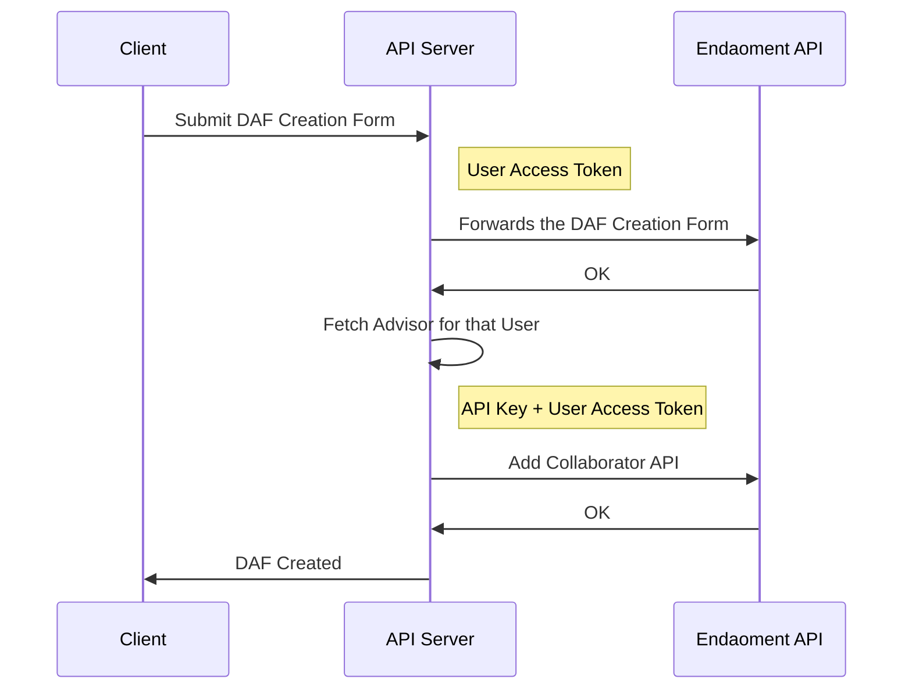
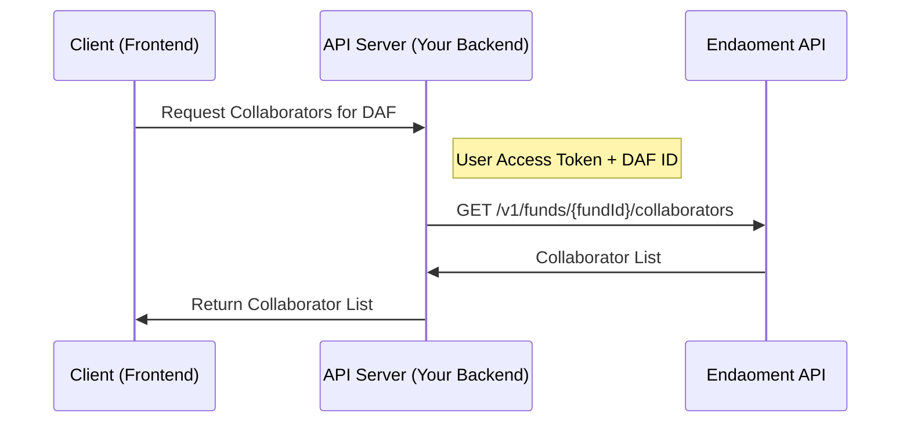
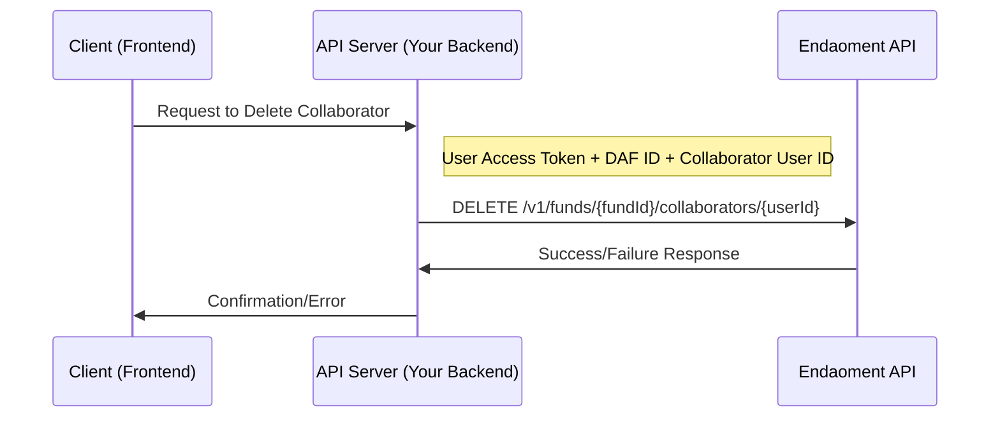

# Adding Collaborators to DAFs

Collaborators are additional users who can interact with your DAF in a limited capacity:

- Collaborators can recommend operations to be executed by the Fund Manager, such as:
  - Making contributions to the fund
  - Recommending grants to charitable organizations
  - Suggesting investment changes
- The Fund Manager maintains full control and can:
  - Approve or reject operations proposed by Collaborators
  - Remove Collaborators from the fund at any time
  - Manage Collaborator permissions
- Collaborators cannot:
  - Execute operations directly without Manager approval
  - Modify fund settings or structure
  - Add or remove other Collaborators

## Platform Requirements

To enable Collaborator Management on your platform, you must review and agree to Endaoment's Terms and Conditions for Collaborator Management and Pass our security and compliance review.

For assistance with enabling this feature or to request access, please contact our Platform Integration team at admin@endaoment.org.

We'll guide you through the necessary steps and documentation requirements. If approved, you will receive and API Key that will allow you to call the `Manage Collaborator` APIs.

## User Prerequisites

To add someone as a collaborator:

1. The user adding the collaborator must be authenticated via OAuth (see [Login User Documentation](./login-user.mdx))
2. The person being added as a collaborator must also have an Endaoment account and be authenticated through your application
3. You'll need the Endaoment user ID of the person being added as a collaborator, which is obtained after they authenticate through your platform.

This ensures:

- Proper authentication of both parties
- Secure access control for the DAF
- Clear audit trail of who added whom as a collaborator
- The collaborator can access the DAF through your application with appropriate permissions

## Flow overview

- The [Add Collaborator API](https://docs.endaoment.org/developers/api/funds/add-a-trusted-collaborator-to-a-fund) allows your platform to add new collaborators to DAFs that belong to users connected to your application
- Due diligence on collaborators must be performed by the integrator platform, as per contractual agreements, before they can be added to DAFs
- The API will only allow collaborators to be added if:
  - The requesting user, identified by the Access Token, owns the DAF
  - The collaborator has an active Endaoment account
  - The platform is allowed to add collaborators to user's DAF's

There are several ways to implement collaborator management using our API:

1. **Pre-selection Model**

   - Your platform automatically assigns a trusted advisor (e.g., a Private Wealth Manager) as a collaborator when the DAF is created
   - This model works well for wealth management platforms where clients already have an established relationship with an advisor
   - See our [quickstart example](https://github.com/endaoment/endaoment-integration-docs/tree/main/quickstart) for a reference implementation

2. **Trusted List Model**

   - Your platform maintains a vetted list of approved collaborators
   - Users can select collaborators only from this pre-approved list
   - This provides control while still giving users choice
   - Recommended for platforms that work with a network of verified professionals

3. **Review & Approval Model**
   - Users can request any collaborator
   - Your platform's back office reviews each request
   - Only approved collaborators are added via the Endaoment API
   - Best for platforms that need maximum flexibility but want oversight

Our quickstart code, as well as the example below, use the Pre-selection model due to it's simplicity and common use case.



## Step-by-step Instructions

### 1. Select and Validate the Collaborator

Before calling the Add Collaborator API, you'll need to implement the logic to select and validate potential collaborators. Here are the key considerations:

#### Selecting the Collaborator

- You must obtain the Endaoment User ID of the person you want to add as a collaborator
- This ID is obtained after the collaborator authenticates through your platform
- The selection process can be implemented in various ways:
  - User selection from a pre-approved list
  - Automatic assignment based on business rules
  - Manual input by the DAF owner

#### Example Implementation

In our quickstart example, we demonstrate a simple checkbox approach where users can opt to add their Platform-assigned Financial Advisor as a collaborator:

```html
<div>
  <label htmlFor="addMyAdvisorToDaf">
    <input type="checkbox" id="addMyAdvisorToDaf" name="addMyAdvisorToDaf" />
    Add my Financial Advisor to the DAF
  </label>
</div>
```

When the user selects this option, the system automatically adds their Financial Advisor during DAF creation. This logic is implemented in the [backend/routes/create-daf.ts file](https://github.com/endaoment/endaoment-integration-docs/blob/main/quickstart/backend/src/routes/create-daf.ts) in the [quickstart example](https://github.com/endaoment/endaoment-integration-docs/tree/main/quickstart/):

```typescript
// If the user wants to add their financial advisor to the DAF, we need to add them as a
// collaborator at Endaoment
if (addMyAdvisorToDaf) {
  console.log('Adding my advisor to the DAF');
  await addCollaboratorToFund(response.id, token);
}
```

### 2. Call the Add Collaborator API

Once you have selected and validated the collaborator, you can proceed with adding them to the DAF using the Add Collaborator API.

#### API Requirements

- The requesting user (identified by the Access Token) must be the owner of the DAF
- Your platform must have a valid API key with collaborator management permissions
- The collaborator must have an active Endaoment account
- The request must include:
  - The DAF ID (`fundId`)
  - The collaborator's Endaoment User ID (`userId`)
  - A company name for the collaborator (`companyName`)

#### Example Implementation

The following code snippet, taken from the [backend/utils/add-collaborator.ts file](https://github.com/endaoment/endaoment-integration-docs/blob/main/quickstart/backend/src/utils/add-collaborator.ts) in the [quickstart example](https://github.com/endaoment/endaoment-integration-docs/tree/main/quickstart/), demonstrates how to call the API:

```typescript
const body: CreateFundCollaboratorBody = {
  companyName: 'Endaoment Wealth',
  userId,
};

// To see the full API documentation and data contract, visit https://docs.endaoment.org/developers/api/funds/add-a-trusted-collaborator-to-a-fund
const addCollaboratorResponse = await fetch(
  `${getEndaomentUrls().api}/v1/funds/${fundId}/collaborators/trust`,
  {
    method: 'POST',
    headers: {
      'Content-Type': 'application/json',
      Authorization: `Bearer ${token}`,
      'x-api-key': apiKey,
    },
    body: JSON.stringify(body),
  },
);
```

#### Response Handling

- The API will return a success response if the collaborator is added successfully
- If there are any issues (e.g., invalid permissions, inactive account), the API will return an appropriate error response
- Your platform should handle both success and error cases appropriately
- Consider implementing retry logic for transient failures
- Log all API responses for audit purposes

For complete API documentation and data contract details, visit the [Add Collaborator API endpoint](https://docs.endaoment.org/developers/api/funds/add-a-trusted-collaborator-to-a-fund).

# List Collaborators

This section outlines how to retrieve a list of collaborators associated with a Donor-Advised Fund (DAF).

## User Prerequisites

- The user requesting the list of collaborators must be authenticated via OAuth.
- The user typically needs to be the DAF owner or have appropriate permissions to view collaborator information.

## Flow Overview

- The [List Collaborators API](https://api.dev.endaoment.org/oas#/Funds/FundsController_getFundCollaborators) allows your platform to fetch collaborators for a DAF.
- The API returns a list of collaborators, including their user details.



## Step-by-step Instructions

### 1. Identify the DAF

Your application needs to know which DAF's collaborators to list. This is typically identified by a `fundId`.

### 2. Call the List Collaborators API

Your backend will make a request to the Endaoment API to retrieve the collaborators.

#### API Requirements

- The requesting user (identified by the Access Token) must have permission to view collaborators for the DAF.
- Your platform must use its API key.
- The request must include:
  - The DAF ID (`fundId`) as a path parameter in the URL.

#### Example Backend Implementation

The following code snippet, inspired by [backend/src/utils/get-collaborators.ts](https://github.com/endaoment/endaoment-integration-docs/blob/main/quickstart/backend/src/utils/get-collaborators.ts), demonstrates how to call the API:

```typescript
// From quickstart/backend/src/utils/get-collaborators.ts
import { getEndaomentUrls } from './endaoment-urls';

export interface CollaboratorListingDto {
  id: string;
  email: string;
  firstName: string;
  lastName: string;
  collaboratorUserId: string; // This is the Endaoment User ID of the collaborator
  fundId: string;
}

export async function getCollaboratorsForFund(
  fundId: string,
  token: string,
): Promise<CollaboratorListingDto[]> {
  const apiUrl = `${getEndaomentUrls().api}/v1/funds/${fundId}/collaborators`;

  const response = await fetch(apiUrl, {
    method: 'GET',
    headers: {
      Authorization: `Bearer ${token}`, // User's access token
      'Content-Type': 'application/json',
    },
  });

  if (!response.ok) {
    const errorData = await response.json();
    console.error('Failed to fetch collaborators', response.status, errorData);
    throw new Error(`Failed to fetch collaborators: ${response.statusText}`);
  }

  return response.json() as Promise<CollaboratorListingDto[]>;
}
```

The route handler in [backend/src/routes/get-collaborators.ts](https://github.com/endaoment/endaoment-integration-docs/blob/main/quickstart/backend/src/routes/get-collaborators.ts) uses this utility function:

```typescript
// From quickstart/backend/src/routes/get-collaborators.ts
import type { Request, Response } from 'express';
import { getAccessToken } from '../utils/access-token';
import {
  getCollaboratorsForFund,
  CollaboratorListingDto,
} from '../utils/get-collaborators';

export const getCollaborators = async (req: Request, res: Response) => {
  const fundId = req.query['fundId'] as string; // The quickstart uses a query param

  if (!fundId) {
    res
      .status(400)
      .json({ message: 'Missing fundId in request query parameters' });
    return;
  }

  const token = getAccessToken(req);
  if (!token) {
    res
      .status(401)
      .json({ message: 'Unauthorized: Access token is missing or invalid' });
    return;
  }

  try {
    const collaborators: CollaboratorListingDto[] =
      await getCollaboratorsForFund(fundId, token);
    res.status(200).json(collaborators);
  } catch (error) {
    const message =
      error instanceof Error ? error.message : 'An unexpected error occurred';
    res
      .status(500)
      .json({ message: 'Failed to fetch collaborators', error: message });
  }
};
```

#### Response Handling

- The API will return a `200 OK` status with a JSON array of `CollaboratorListingDto` objects if successful.
- If there are any issues (e.g., DAF not found, unauthorized), the API will return an appropriate error response.
- Your platform should handle both success and error cases, displaying the collaborator list or an error message.

For complete API documentation and data contract details, visit the [List Collaborators API endpoint](https://api.dev.endaoment.org/oas#/Funds/FundsController_getFundCollaborators).

# Delete Collaborators

This section describes how to remove a collaborator from a DAF.

## User Prerequisites

- The user performing the deletion must be authenticated via OAuth.
- Typically, the DAF owner is the one authorized to remove collaborators.
- You'll need the Endaoment User ID (`userId`) of the collaborator to be removed and the DAF ID (`fundId`).

## Flow Overview

- The [Delete Collaborator API](https://api.dev.endaoment.org/oas#/Funds/FundsController_deleteFundCollaborator) enables your platform to remove collaborators from a DAF.
- The DAF owner, through your platform, initiates the removal.



## Step-by-step Instructions

### 1. Identify DAF and Collaborator

Your application needs to identify:

- The DAF from which to remove the collaborator (`fundId`).
- The collaborator to be removed (`userId`). This is the Endaoment User ID of the collaborator.

### 2. Call the Delete Collaborator API

Your backend makes a request to the Endaoment API to remove the specified collaborator.

#### API Requirements

- The requesting user (identified by the Access Token) must be the owner of the DAF or have equivalent permissions.
- Your platform must use its API key.
- The request must include:
  - The DAF ID (`fundId`) as a path parameter.
  - The Collaborator's Endaoment User ID (`userId`) as a path parameter.

#### Example Backend Implementation

The following code snippet, taken from [quickstart/backend/src/utils/remove-collaborator.ts](https://github.com/endaoment/endaoment-integration-docs/blob/main/quickstart/backend/src/utils/remove-collaborator.ts), shows how to call the API:

```typescript
import { getEndaomentUrls } from './endaoment-urls';

export async function removeCollaboratorFromFund(
  fundId: string,
  token: string,
  userIdToRemove: string,
) {
  // To see the full API documentation and data contract, visit https://api.dev.endaoment.org/oas#/Funds/FundsController_deleteFundCollaborator
  const removeCollaboratorResponse = await fetch(
    `${
      getEndaomentUrls().api
    }/v1/funds/${fundId}/collaborators/${userIdToRemove}`,
    {
      method: 'DELETE',
      headers: {
        Authorization: `Bearer ${token}`, // User's access token
      },
    },
  );

  if (!removeCollaboratorResponse.ok) {
    const response = await removeCollaboratorResponse.json();
    console.error('Failed to remove collaborator from fund', response);
    throw new Error('Failed to remove collaborator from fund');
  }

  console.log('Collaborator removed from fund');
  return {
    status: removeCollaboratorResponse.status,
    statusText: removeCollaboratorResponse.statusText,
  };
}
```

The route handler in [quickstart/backend/src/routes/remove-collaborator.ts](https://github.com/endaoment/endaoment-integration-docs/blob/main/quickstart/backend/src/routes/remove-collaborator.ts) uses this utility:

```typescript
import type { Request, Response } from 'express';
import { getAccessToken } from '../utils/access-token';
import { removeCollaboratorFromFund } from '../utils/remove-collaborator';

export const removeCollaborator = async (req: Request, res: Response) => {
  const fundId = req.params['fundId'] as string;
  const userId = req.params['userId'] as string; // This is the collaborator's Endaoment User ID

  if (!fundId || !userId) {
    res
      .status(400)
      .json({ message: 'Missing fundId or userId in request parameters' });
    return;
  }

  const token = getAccessToken(req);
  if (!token) {
    res
      .status(401)
      .json({ message: 'Unauthorized: Access token is missing or invalid' });
    return;
  }

  try {
    const removalResponse = await removeCollaboratorFromFund(
      fundId,
      token,
      userId,
    );
    res.status(removalResponse.status).json(removalResponse);
  } catch (error) {
    const message =
      error instanceof Error ? error.message : 'An unexpected error occurred';
    res
      .status(500)
      .json({ message: 'Failed to remove collaborator', error: message });
  }
};
```

#### Response Handling

- A successful deletion will return A `200 OK` status.
- If the collaborator or DAF is not found, or the user lacks permissions, an appropriate error (e.g., `404 Not Found`, `403 Forbidden`) will be returned.
- Your platform should confirm successful deletion or display an error message.
- Consider refreshing the collaborator list upon successful deletion.

For complete API documentation and data contract details, visit the [Delete Collaborator API endpoint](https://api.dev.endaoment.org/oas#/Funds/FundsController_deleteFundCollaborator).
